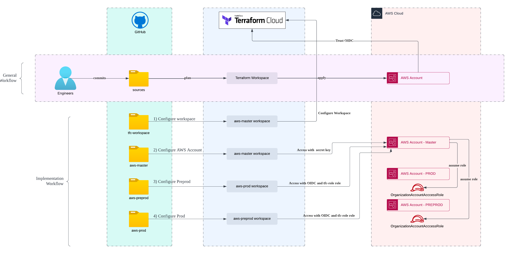

# Terraform AWS ECS GitOps

This repository demonstrate Terraform GitOps setup to provision AWS ECS. It respect the DevSecOps to reduce distribution of AWS Credential by using Terraform Dynamic credential.

## High level workflow

This is the high level workflow for this monorepo GitOps setup.


## Requirements

You need to have the following accounts to follow this setup

1. [Terraform Cloud](https://app.terraform.io/public/signup/account)
2. [AWS Account](https://signin.aws.amazon.com/signin)
3. [GitHub](https://github.com/signup)

## Usage

1. **Fork** the repo on GitHub
2. **Clone** the project to your local

## Configure GitHub App Integration

We need GitHub to integrate with Terraform Cloud, so that when any change in GitHub, Terraform Cloud will able to trigger changes, follow [this](https://developer.hashicorp.com/terraform/enterprise/admin/application/github-app-integration) to install GitHub App.

## Configure Terraform Workspace

All the AWS provision happen in Terraform Workspace, we will need to only manually configure one workspace, that is **tfc-workspace**

## Configure tfc-workspace environment

1. Create new workspace in Terraform Cloud with name **tfc-workspace**
2. Configure Version Control point to your GitHub repository that you forked
3. Change Terraform Working Directory to **stacks/00-tfc-workspace**
4. Add new variable name **organization**, set as terraform variable, and enter your organization name
5. Add new variable name **TFE_TOKEN**, set as sensitive environment variable, and enter value you create from [Tokens page](https://app.terraform.io/app/settings/tokens)
6. Add new variable name **github_install_id**, set as sensitive terraform variable, and enter GitHub App Installation Id from here [Token Page](https://app.terraform.io/app/settings/tokens)
7. Go to [workspace-variables.yaml](stacks/00-tfc-workspace/configs/workspace-variables.yaml), uncomment the following block, and replace your organization name

```
# aws-master:
#   - key: tfc_organization_name
#     category: terraform
#     value: <<replace-terraform-organization-name>>

```

7. Commit and push the code

## Configure aws-master environment

1. Create new AWS access key, secret key for use on first AWS integration
2. Go to Terraform Cloud, and add new variable name **tfc_organization_name**, set as terraform variable, and enter your organization name
3. Add new variable name **AWS_ACCESS_KEY_ID** and **AWS_SECRET_ACCESS_KEY** as sensitive environment variable, enter the value create from step 1
4. Go to [accounts.tf](stacks/10-aws-master/accounts.tf), uncomment the following block, and fill in your email for preprod and prod account

```
resource "aws_organizations_account" "prod" {
  name = "PROD Lab"
  #You need to have unique email for each AWS Account, uncomment email block and provide your email
  #email     = "<<replace your prod account email>>"

  #We will create consistent Org Access Role for easy management
  role_name = "OrganizationAccountAccessRole"

  lifecycle {
    ignore_changes = [role_name]
  }
}

resource "aws_organizations_account" "preprod" {
  name = "Preprod"
  #You need to have unique email for each AWS Account, uncomment email block and provide your email
  #email     = "<<replace your prod account email>>"

  #We will create consistent Org Access Role for easy management
  role_name = "OrganizationAccountAccessRole"

  lifecycle {
    ignore_changes = [role_name]
  }
}

```

5. Commit and push the changes
6. After Terraform Workspace success provision, capture the account number for Preprod and Prod environment for later use.

## Configure tfc-workspace for Preprod and Prod workspace

1. Go to [workspace-variables.yaml](stacks/00-tfc-workspace/configs/workspace-variables.yaml), uncomment the following block, and fill in Master, Preprod, and Prod account number respectively.

```
# aws-preprod:
#   - key: TFC_AWS_PROVIDER_AUTH
#     value: true
#   - key: TFC_AWS_RUN_ROLE_ARN
#     value: arn:aws:iam::<<replace-aws-master-account-number>>:role/tfc-role
#   - key: aws_provision_id
#     category: terraform
#     value: <<replace-aws-preprod-account-number>>
#   - key: aws_provision_role
#     category: terraform
#     value: OrganizationAccountAccessRole

# aws-prod:
#   - key: TFC_AWS_PROVIDER_AUTH
#     value: true
#   - key: TFC_AWS_RUN_ROLE_ARN
#     value: arn:aws:iam::<<replace-aws-master-account-number>>:role/tfc-role
#   - key: aws_provision_id
#     category: terraform
#     value: <<replace-aws-prod-account-number>>
#   - key: aws_provision_role
#     category: terraform
#     value: OrganizationAccountAccessRole
```

2. Commit and push the changes
3. And you should see new 2 workspace plan, and ready to apply

## Sample Infrastructure

The sample Elastic Container Service infrastructure refer from [Microservice Infra](https://github.com/jazztong/microservice-theinfra/tree/main/modules)

## License

[](https://opensource.org/licenses/Apache-2.0)

See [LICENSE](LICENSE) for full details.

```text
Licensed to the Apache Software Foundation (ASF) under one
or more contributor license agreements.  See the NOTICE file
distributed with this work for additional information
regarding copyright ownership.  The ASF licenses this file
to you under the Apache License, Version 2.0 (the
"License"); you may not use this file except in compliance
with the License.  You may obtain a copy of the License at

  https://www.apache.org/licenses/LICENSE-2.0

Unless required by applicable law or agreed to in writing,
software distributed under the License is distributed on an
"AS IS" BASIS, WITHOUT WARRANTIES OR CONDITIONS OF ANY
KIND, either express or implied.  See the License for the
specific language governing permissions and limitations
under the License.
```

## About

This project is maintained by [Jazz](jazz.twk@gmail.com). Like it? Please let me know by email me, and star this repository.
